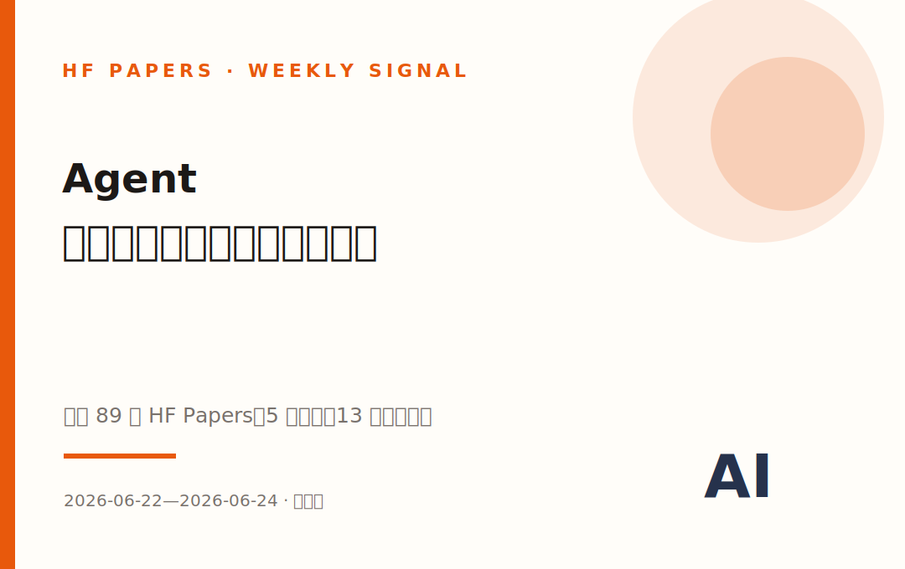
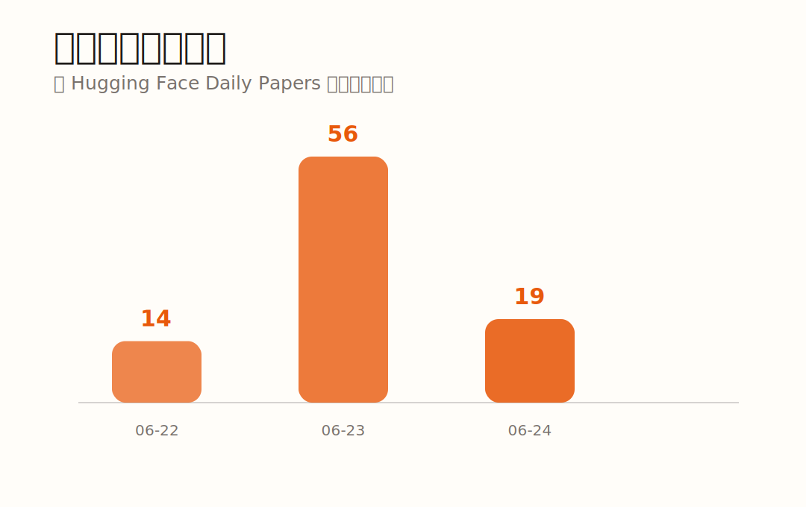
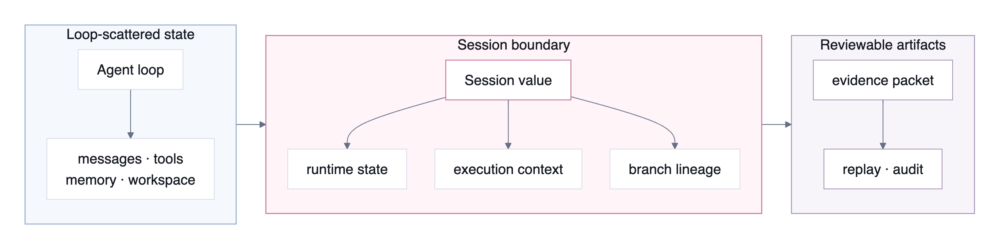
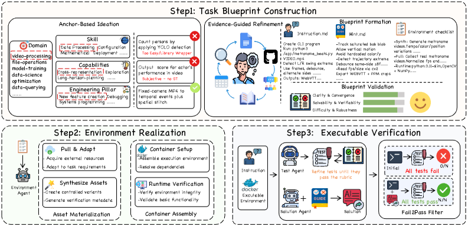
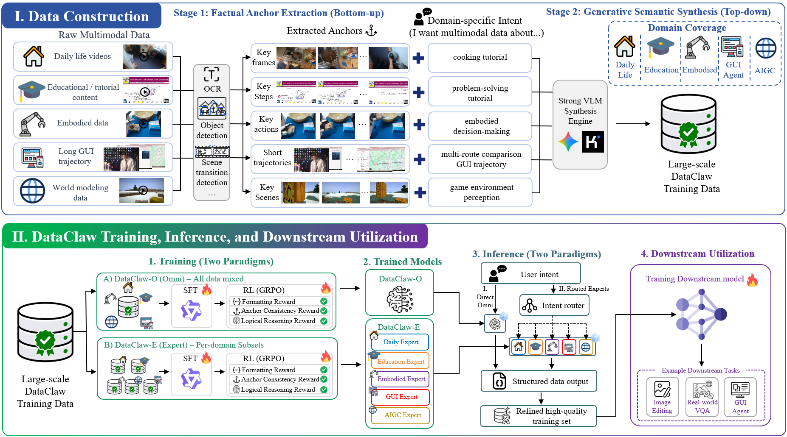
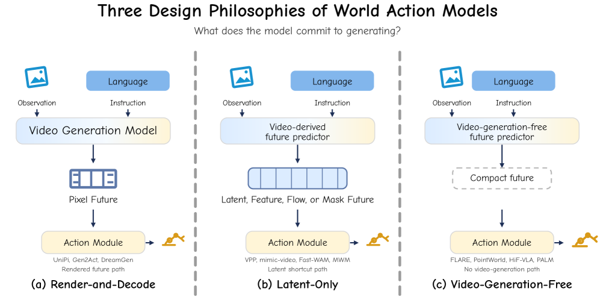
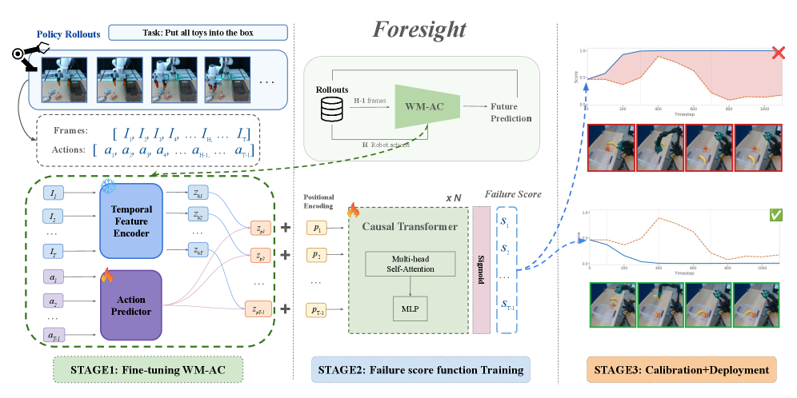
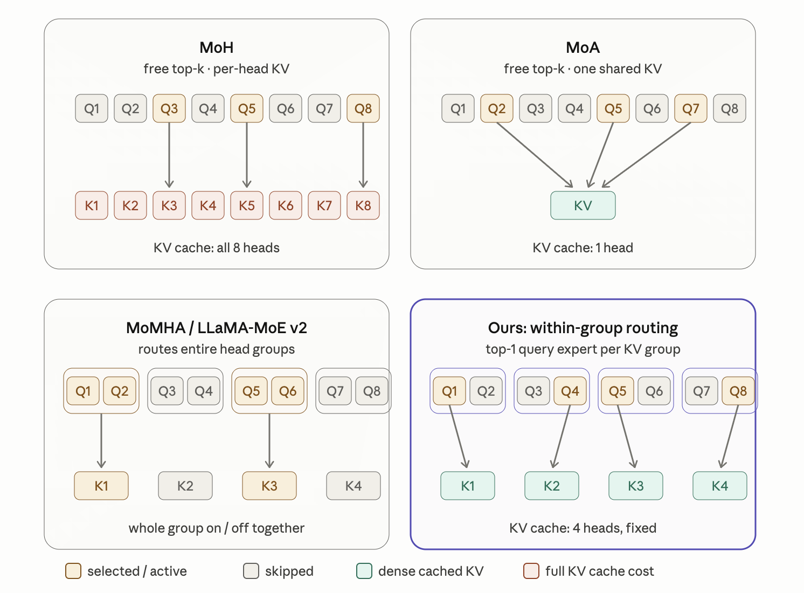
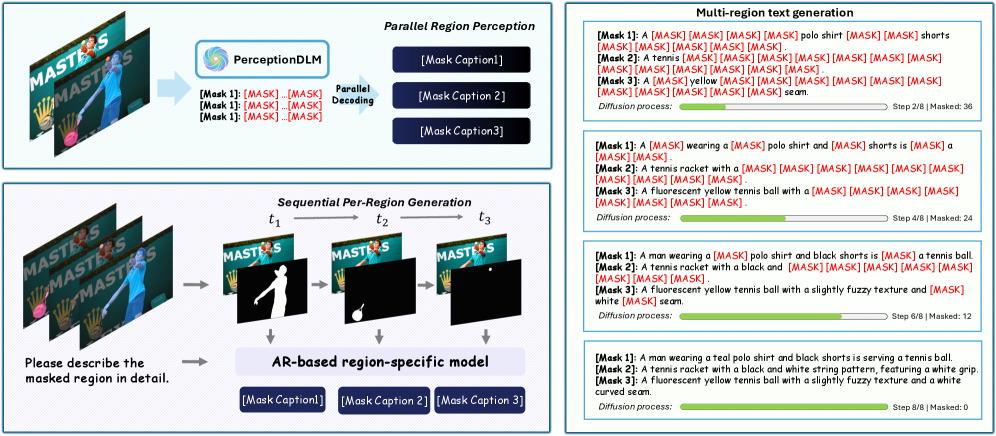
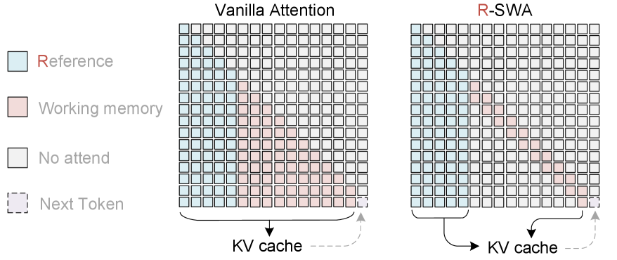

# Agent 不缺大脑，开始缺操作系统了｜P站本周论文盘点

> 本期 89 篇 HF Daily Papers · 5 大主线 · 13 篇代表论文带「🤔 真正的 insight」



*封面：Agent研究的竞争焦点正在从模型能力下沉到系统工程。来源：原创编辑视觉。*

## 你能在前30秒读完这一段，就够你判断这周发生了什么

过去三天，产品圈还在争论谁家的Agent更聪明、谁能多调用几个工具、谁的Demo更像真人。

但你打开 Hugging Face Daily Papers，会看到另一幅画面。

不是Agent突然更会思考了——是研究者终于承认：**大多数Agent死得不是因为大脑不够强，而是因为没有一套像样的操作系统。**

工具会静默失效，长任务会把关键事实淹没在历史消息里，多用户记忆会泄露不该泄露的信息，训练数据看起来像任务却根本跑不通，真实环境又贵、又慢、还很难批量制造故障。

这不是一批互不相关的小修小补。

PlanBench-XL在测工具坏掉之后能不能重规划；OpenRath把Session做成可分支、可合并、可重放的运行时对象；CLI-Universe只保留真正能在Docker里fail-to-pass的训练任务；Qwen-AgentWorld干脆训练一个模型来扮演终端、网页、Android和MCP环境。

它们拼起来，像一套正在成形的Agent操作系统：

**Benchmark负责暴露失败，Runtime负责记录失败，World Model负责批量制造失败，Training Data负责让模型学会从失败里回来。**

在本期冻结快照的Top 20里，直接研究Agent、Agent运行环境、训练数据或Agent评测的论文有 **13篇（65%）**，拿走Top 20总upvote的 **538/782（68.8%）**。

票数很热，但票数也掩盖了真正的信号。

真正的变化不是“Agent论文变多了”，而是Agent研究第一次开始系统性补齐软件工程、数据工程和可靠性工程欠下的债。

## 三个被票数掩盖的结构性观察

### 1. Agent Benchmark正在从“谁答对了”变成“谁坏得更明白”

PlanBench-XL故意让工具缺失、失败和误导；EnterpriseClawBench不只看最终答案，还看交付物、视觉质量、成本、时间和Harness；NatureBench追问Coding Agent究竟是在做科学发现，还是把陌生问题套进熟悉的监督学习模板。

→ 结论：未来最值钱的Agent评测，不是把成功率再卷高两个点，而是告诉团队**它会在哪种失败模式上翻车，以及为什么翻车**。

### 2. Memory不再是“多塞点上下文”，而是权限、遗忘和状态治理

MemGUI-Agent让模型主动决定哪些历史该折叠；GateMem发现共享记忆系统在实用性、访问控制和主动遗忘之间没有一个方法能同时做好；OpenRath则把分支来源、工具副作用和记忆事件一起装进Session。

→ 结论：Agent记忆的下半场不是Recall，是Governance。记得更多不一定更好，**知道谁能看、什么时候该忘、出错后如何重放**才是部署门槛。

### 3. World Model从“生成一个世界”变成“替Agent扮演世界”

Qwen-AgentWorld不追求生成漂亮视频，而是预测你执行一条命令、点一下网页、调用一个MCP工具之后，环境会返回什么。Foresight则用动作条件世界模型的潜变量判断机器人长任务什么时候开始失败。

→ 结论：World Model正在从内容生成技术，变成Agent训练和监控基础设施。



*图1：本期每日收录论文数量；6月23日贡献了大部分样本。来源：根据冻结的 `papers.json` 原创统计。*

## 数据快照

| 指标 | 冻结数字 | 它真正说明什么 |
|---|---:|---|
| 覆盖日期 | 2026-06-22至06-24 | 三天部分周，不和完整周硬比 |
| HF Daily Papers | 89篇 | 去重后仍为89篇 |
| 带GitHub链接 | 62/89（69.7%） | 代码开放程度不低 |
| 带项目页 | 55/89（61.8%） | 多数头部工作有演示或补充材料 |
| upvote中位数 | 5 | 注意力高度集中在头部 |
| Top 20中Agent相关 | 13/20（65%） | 采用保守人工分类 |
| Agent相关Top 20票数 | 538/782（68.8%） | 篇数和热度同时集中 |
| 快照票王 | PlanBench-XL，82票 | 评测论文压过了模型论文 |

## 5大主线：但请用“Agent开始缺操作系统”这个视角看它们

| # | 主线 | 它在回答什么 | 它揭示了什么 |
|---|---|---|---|
| 1 | 失败模式评测 | Agent到底怎么坏？ | 总成功率正在失去解释力 |
| 2 | Runtime与记忆治理 | 状态到底放在哪里？ | Memory首先是系统问题，不是Prompt问题 |
| 3 | 可验证训练数据 | 什么任务真的能教会Agent？ | 可执行环境比题目数量更稀缺 |
| 4 | World Model环境化 | 真实环境不够用怎么办？ | 模拟器开始成为Agent训练基础设施 |
| 5 | 计算底座换代 | 长任务为什么又慢又贵？ | 注意力、解码与KV缓存都在被重写 |

## 01

## Agent Benchmark开始研究“怎么坏”

判断：**“通用Agent总分最高”这个叙事正在过期。下一阶段的壁垒，是你对哪一种失败模式理解得最深。**

### 为什么这件事现在发生

因为正常路径快被Demo做烂了。

只要工具都在线、页面不变、权限足够、上下文没爆，前沿模型已经能完成相当多的短流程任务。继续把同一套任务从70分刷到73分，对真实产品的帮助越来越小。

真正把产品打崩的，是Benchmark过去不爱测的东西：

- 工具没有报错，但返回了空数据；
- 正确工具藏在1,665个候选里；
- 替代路径比正常路径长十步；
- 任务做完了，但Excel、PPT和报告根本不能交付；
- Agent复现了论文，却没提出任何新方法。

这不是评测内卷，是评测终于开始碰真实世界。

### 代表论文

### PlanBench-XL · 快照82票

通用工具调用Benchmark通常问“你会不会用工具”。PlanBench-XL问得更狠：**工具看不全、工具会坏、工具还会骗你时，你还能不能把任务做完？**

- 💡 机制：327个零售任务、1,665个工具。Agent必须迭代检索工具、调用工具、从中间结果推断隐含子目标。Blocking机制会制造缺失、失败或干扰工具。
- 📈 结果：论文报告GPT-5.4在无阻断环境中准确率51.90%，在最严重阻断条件下降至11.36%。没有明确错误信号、替代路径更长时最容易崩。
- ⚠️ 局限：零售工具生态不等于所有企业系统；工具检索器、接口描述和Harness都会影响成绩。
- 🛠 你能学到什么：别只记录任务成功率。把“发现异常用了几步、替代路径多长、是否识别静默失败”单独做成生产指标。
- 🤔 真正的 insight：这篇论文最重要的不是又造了一个难Benchmark，而是把Agent可靠性的脏秘密摆上桌面——**大多数系统不是不会走正确路径，而是不知道自己已经走错了。**

[HF](https://huggingface.co/papers/2606.22388) · [arXiv](https://arxiv.org/abs/2606.22388) · [GitHub](https://github.com/JiayuJeff/PlanBench-XL)


*图2：PlanBench-XL整体框架：从可执行工具与查询构造，到检索—调用协议和运行时阻断。来源：论文官方项目页overview图。*

### EnterpriseClawBench · 快照62票

这周最接近“企业真相”的Benchmark：它不拿几百道干净题考Agent，而是从真实工作会话里恢复任务。

- 💡 机制：852个可复现任务，每个任务配Fixture、角色、技能子类、硬规则和语义Rubric；评测对象是Harness与模型的组合。
- 📈 结果：论文报告最佳配置Codex + GPT-5.5得分0.663，并要求同时报告交付物、视觉质量、成本、运行时间和技能迁移。
- ⚠️ 局限：原始会话含企业内部内容，数据不公开。协议能复用，任务分布却无法被外部完整审计。
- 🛠 你能学到什么：采购Agent时不要问“哪个模型第一”。固定模型、轮换Harness、记忆、工具权限和沙箱，才能知道钱到底花在了哪里。
- 🤔 真正的 insight：企业Agent的竞争单位已经不是Model，是 **Model × Harness × Workspace**。只卖一个模型API，就像只卖发动机却说自己卖整辆车。

[HF](https://huggingface.co/papers/2606.23654) · [arXiv](https://arxiv.org/abs/2606.23654) · [GitHub](https://github.com/FrontisAI/EnterpriseClawBench)

### NatureBench · 快照32票

名字很野心：Coding Agent能不能超过Nature论文里的已发表SOTA？

答案很冷静：大部分时候不能。

- 💡 机制：把Nature系列论文变成90个容器化科研任务；禁止Web搜索，评测十种前沿Agent配置，并由维护方复现实验。
- 📈 结果：最强系统只有17.8%的任务达到论文定义的超越SOTA标准。成功更多来自把科研问题翻译成熟悉的监督预测任务，而非发明新方法。
- ⚠️ 局限：90个任务覆盖不了科学研究全貌；算力预算和复现误差也会影响“超过SOTA”的判断。
- 🛠 你能学到什么：做科研Agent，必须把“方法选择是否新颖且合理”从“代码有没有跑通”里拆出来测。
- 🤔 真正的 insight：AI科学家的第一阶段可能不是发现科学，而是**把陌生科学问题快速降维成熟悉工程问题**。这已经很值钱，但离“自动科学家”还差一个最难的词：原创。

[HF](https://huggingface.co/papers/2606.24530) · [arXiv](https://arxiv.org/abs/2606.24530) · [GitHub](https://github.com/FrontisAI/NatureBench)

### 🔍 技术综观

三篇论文看起来分别在做工具、企业和科研，底层其实在重写同一个公式：

```text
Agent质量 ≠ 最终答案分数
Agent质量 = 成功率 × 恢复能力 × 交付质量 × 成本可控 × 方法选择
```

下一代Benchmark不会只有一个排行榜，而会像故障诊断仪：告诉你系统是检索错了、规划断了、状态丢了，还是做出了一个看似正确但无法交付的东西。

### 💼 落地实战

场景一：你是Agent产品PM，Demo很稳、线上经常翻车。  
→ 把20%的评测预算用来制造静默失败，不要全部花在正常任务上。

场景二：你在选企业Agent方案。  
→ 固定同一个模型比较不同Harness，记录成本、时间、交付物和恢复路径。

场景三：你做Coding Agent。  
→ 别只盯SWE-Bench；增加“找对方法”和“能否超过已有基线”的任务。

Agent为什么会在失败后迷路？因为它连自己刚才经历了什么都不一定说得清。下一节看运行时和记忆。 ↓

## 02

## Memory的下半场不是Recall，是Governance

判断：**“给Agent加个向量库”正在变成上一代答案。真正困难的是状态、权限、遗忘和重放。**

### 为什么这件事现在发生

Agent任务变长了，也变脏了。

短任务里，ReAct把每一步都追加进Prompt还能凑合。跨十几个页面、多个App、多人共享记忆以后，历史记录会爆炸，关键事实会稀释，不同用户的数据还会混在一起。

更麻烦的是，记忆系统过去只问“能不能找回来”，现在必须同时回答：

- 这个用户有没有权看？
- 删除以后模型真的忘了吗？
- 分支任务合并时谁覆盖谁？
- 工具已经修改文件，日志和沙箱能否对得上？
- 出事故后能否重放到出错前一刻？

这意味着Memory不再是一个RAG组件，而是一套治理系统。

### 代表论文

### OpenRath · 快照71票

这周最像“Agent版PyTorch”的系统论文。它不把Session当聊天ID，而是当运行时里真正流动的值。

- 💡 机制：Session统一记录对话Chunk、工具效果、沙箱位置、分支来源、Token使用、Pending Work和记忆事件；fork、merge、replay变成显式操作。
- 📈 结果：论文展示编程模型、架构和证据协议，没有用一张夸张Benchmark表证明自己全面领先。
- ⚠️ 局限：广泛量化比较、线上Provider质量、可选后端和记忆质量仍留给后续工作。
- 🛠 你能学到什么：Agent框架必须原生支持状态快照、分支来源、工具副作用和重放。靠日志平台事后拼，不叫运行时。
- 🤔 真正的 insight：今天的Agent框架像早期Web开发——功能冲得很快，状态模型却一团乱。OpenRath是不是最终答案不重要，**一等Session对象会不会成为标准答案，才值得赌。**

[HF](https://huggingface.co/papers/2606.19409) · [arXiv](https://arxiv.org/abs/2606.19409) · [GitHub](https://github.com/Rath-Team/OpenRath)



*图3：OpenRath把Agent循环周围的旁路状态提升为可分支的Session运行时值。来源：OpenRath论文Figure 1。*

### MemGUI-Agent · 快照20票

移动Agent长任务失败，一个被忽略的原因不是看不懂屏幕，是Prompt被自己的历史淹死。

- 💡 机制：Context-as-Action让模型主动输出上下文管理动作，维护折叠后的Action History、折叠UI状态和最近步骤三类结构化字段。
- 📈 结果：作者构建2,956条完整ConAct标注轨迹；8B模型在MemGUI-Bench取得开放数据8B模型最佳表现，并迁移到分布外MobileWorld。
- ⚠️ 局限：主动压缩一旦折错，关键事实可能永久丢失；摘要没有展示不同压缩策略的完整误差分解。
- 🛠 你能学到什么：长程GUI Agent不要只扩大Context Window。让模型学会决定“现在该记什么、该折叠什么”。
- 🤔 真正的 insight：Prompt Explosion不是Token账单问题，是决策质量问题。**上下文越长，错误信息也越有机会被反复引用。** 主动遗忘可能比无限记忆更接近真正的智能。

[HF](https://huggingface.co/papers/2606.19926) · [arXiv](https://arxiv.org/abs/2606.19926) · [GitHub](https://github.com/kwai/MemGUI-Agent)

### GateMem · 快照15票

这是本周票数最容易低估的一篇：它测的不是Agent记不记得，而是共享记忆会不会泄密。

- 💡 机制：在医疗、办公、教育和家庭四类多主体场景里，同时评估合法请求实用性、上下文授权边界和删除后的主动遗忘。
- 📈 结果：不同Backbone和记忆方法中，没有一个同时做到高实用性、强访问控制和可靠遗忘。长上下文治理分高但Token贵，检索和外部记忆省成本却仍会泄露。
- ⚠️ 局限：Benchmark中的角色与授权规则仍是人工形式化，现实组织的模糊权限更难。
- 🛠 你能学到什么：共享Agent上线前，必须测试跨用户查询、角色切换、删除后再问和间接提示泄露。
- 🤔 真正的 insight：Memory产品一直把“记住一切”当卖点，GateMem提醒你：在医院、公司和家庭里，**一个不会忘、不会拒绝的Agent不是助手，是数据事故。**

[HF](https://huggingface.co/papers/2606.18829) · [arXiv](https://arxiv.org/abs/2606.18829) · [GitHub](https://github.com/rzhub/GateMem)

### 🔍 技术综观

Agent记忆正在分裂成三层：

```text
Working Context：当前任务需要什么
Runtime State：系统刚刚发生了什么
Governed Memory：谁能记住什么、何时必须忘
```

把这三层全塞进一个向量库，会得到一个既贵、又乱、还容易泄密的系统。

### 💼 落地实战

场景一：你的Agent任务超过20步。  
→ 把上下文压缩设计成Policy动作，并保存压缩前后的可审计映射。

场景二：多个员工共用同一企业助手。  
→ 在检索准确率之外，单独做越权查询与删除后泄露测试。

场景三：你维护Agent框架。  
→ Session至少包含文件版本、工具副作用、分支来源和可重放检查点。

状态能保存，不代表Agent就能学会正确行动。下一条问题更残酷：你拿什么数据教它？ ↓

## 03

## Agent数据的稀缺，不是缺Prompt，是缺能跑通的世界

判断：**合成一百万道“看起来像任务”的题很容易；合成一万道真的能执行、能失败、能判分的任务才是护城河。**

### 为什么这件事现在发生

Agent训练正在撞上数据假繁荣。

表面上，LLM可以无限生成任务、答案和轨迹。但大量合成任务有三个问题：

- 指令含糊，正确答案不唯一；
- 环境根本装不起来；
- 测试只检查表面字符串，错误方案也能通过。

这类数据越多，Agent越容易学会“像在解决问题”，而不是解决问题。

所以本周真正有价值的数据论文，都把验证环节放到了生成环节前面。

### 代表论文

### CLI-Universe · 快照29票

它不是再生成更多Shell问答，而是做了一台终端Agent任务质检机。

- 💡 机制：从领域、技能、能力和工程支柱组成的分类空间采样，再用真实技术资料把题目落成Blueprint，进入Docker和多阶段可执行测试。
- 📈 结果：从候选到验证约三分之二任务被淘汰；保留6,000条轨迹微调Qwen3-32B后，在Terminal-Bench 2.0达到33.4%。
- ⚠️ 局限：结果集中于终端任务，和真实企业Shell工作流仍可能存在分布差异。
- 🛠 你能学到什么：训练任务至少要满足环境能启动、错误答案会失败、正确答案能通过、Hints不会泄露答案。
- 🤔 真正的 insight：这篇暴露了Agent数据行业的脏秘密：**很多所谓训练集只验证了文本像不像答案，从没验证答案能不能让机器工作。**

[HF](https://huggingface.co/papers/2606.22883) · [arXiv](https://arxiv.org/abs/2606.22883)



*图4：CLI-Universe从任务构造、环境合成到可执行验证的数据生产流水线。来源：CLI-Universe论文Figure 1。*

### DataClaw0 · 快照66票

DataClaw0更进一步：连“整理数据”这件事本身都不想交给静态规则，而是训练成Agent能力。

- 💡 机制：用确定性Factual Anchors约束生成式语义合成，再结合SFT与GRPO训练9B模型，根据用户和下游目标主动裁剪、重组多模态原始流。
- 📈 结果：不只看整理文本质量，而是在视频生成、真实VQA和GUI导航中验证整理后的数据能否改善后训练。
- ⚠️ 局限：摘要缺少一套能跨三个下游任务直接比较的统一数字；“首个数据精炼Benchmark”仍需更多外部工作验证。
- 🛠 你能学到什么：数据Agent的终点指标不是产出多少Caption，是下游模型有没有因此学得更快、更好。
- 🤔 真正的 insight：未来数据团队维护的可能不是ETL Pipeline，而是Data Policy——**它会根据训练目标主动决定保留什么、删掉什么、把什么改写成更高密度的学习信号。**

[HF](https://huggingface.co/papers/2606.21337) · [arXiv](https://arxiv.org/abs/2606.21337) · [GitHub](https://github.com/vancyland/DataClaw0)



*图5：DataClaw0从事实锚点构造数据、训练Data Tailor，再用下游后训练验证数据价值。来源：DataClaw0论文Figure 2。*

### 🔍 技术综观

传统数据生产是：

```text
收集 → 清洗 → 标注 → 训练
```

Agent数据生产正在变成：

```text
提出能力缺口 → 构造环境 → 执行验证 → 过滤伪任务 → 训练 → 用下游失败反推新数据
```

数据不再是静态库存，而是一个闭环系统。

### 💼 落地实战

场景一：你的Agent在内部Benchmark很高、线上很差。  
→ 抽查训练任务是否真的在隔离环境中执行过，而不是只由另一个模型打分。

场景二：你要做垂直Agent微调。  
→ 先建100个高保真环境化任务，再决定是否扩到一万条。

场景三：你有大量视频、屏幕录制和操作日志。  
→ 不要只做统一Caption；按下游目标重组为可学习的决策片段。

但真实环境太贵，光靠Docker和人工回放扩不动。接下来，World Model开始替Agent扮演世界。 ↓

## 04

## World Model不再只生成世界，它开始批量制造失败

判断：**AgentWorld真正值钱的不是“像不像环境”，而是它能不能生成真实世界里很少出现、却最值得训练的坏情况。**

### 为什么这件事现在发生

强化学习需要环境，但Agent环境比游戏环境麻烦得多。

网页会改版，搜索结果会变化，Android App会弹窗，终端依赖会坏，真实账户还涉及成本和权限。你很难把同一个错误稳定复现一千次，更难控制它“这次只坏磁盘、下次只坏工具权限”。

语言世界模型提供了一个诱人的替代方案：把环境反馈也模型化。

不是为了永远取代真实环境，而是为了把真实环境中稀少、危险、昂贵的状态变成可批量训练的数据。

### 代表论文

### Qwen-AgentWorld · 快照53票

这周最有野心的Agent论文：训练一个语言模型，专门预测Agent动作之后环境会发生什么。

- 💡 机制：覆盖MCP、搜索、终端、SWE、Android、Web和OS七类环境；超过一千万条真实交互轨迹经过统一Schema处理，使用CPT、SFT和RL三阶段训练。
- 📈 结果：团队自建AgentWorldBench上，397B版本平均58.71，略高于GPT-5.4的58.25；35B版本由对应基座47.73升至56.39。397B模拟器做Sim RL时，Claw-Eval和QwenClawBench相对基座提升4.3和7.1分。
- ⚠️ 局限：模型和Benchmark来自同一团队，独立复现仍缺；GUI平均能力没有全面领先，文本化可访问树也不等于完整像素世界。
- 🛠 你能学到什么：先用真实轨迹校准，再用模拟器定向生成磁盘不足、工具缺失、搜索不完整等困难状态，最后回真实环境验证。
- 🤔 真正的 insight：真实环境擅长教Agent“世界通常怎样运转”；模型环境的优势是反复追问：**如果世界今天故意为难你，你还会不会做？**

[HF](https://huggingface.co/papers/2606.24597) · [arXiv](https://arxiv.org/abs/2606.24597) · [GitHub](https://github.com/QwenLM/Qwen-AgentWorld)


*图6：Qwen-AgentWorld统一模拟七类Agent环境，并分别作为环境模拟器和Agent预训练底座。来源：Qwen-AgentWorld论文Figure 1。*

### World Action Models · 快照39票

这是一篇Survey，却解决了一个越来越严重的概念混乱：World Model、视频生成、VLA和World Action Model到底是不是一回事？

- 💡 机制：按“生成什么”把方法分成渲染未来、潜变量未来和不生成视频的动作推理；再从预测载体、Backbone、动作耦合和部署方式拆解。
- 📈 结果：Survey总结出一致趋势：方法正在生成更少的未来，只保留控制真正需要的信息，以交换计算、内存、延迟和动作标注成本。
- ⚠️ 局限：Survey提供统一框架，不直接证明某条路线最优；领域仍在快速变化，分类边界可能继续移动。
- 🛠 你能学到什么：做机器人或Agent World Model，先问控制需要预测什么，不要默认必须生成一段漂亮视频。
- 🤔 真正的 insight：World Model研究正在从“把未来画出来”转向“把对行动有用的未来压缩出来”。**生成得越完整不一定越聪明，可能只是越贵。**

[HF](https://huggingface.co/papers/2606.20781) · [arXiv](https://arxiv.org/abs/2606.20781) · [GitHub](https://github.com/world-action-models/awesome-world-action-models)



*图7：World Action Model的三种设计哲学：像素未来、潜变量未来和无视频生成的动作推理。来源：World Action Models论文Figure 2。*

### Foresight · 快照12票

票数不高，但它展示了World Model更现实的一种用途：不是规划下一步，而是监控任务什么时候开始坏。

- 💡 机制：用动作条件世界模型潜变量监控机器人轨迹，只需最终成功/失败标签；再用Functional Conformal Prediction自适应校准阈值。
- 📈 结果：在LIBERO-Long、ManiSkill-Long、BEHAVIOR-1K和两类真实机械臂长任务上，与现有失败检测方法比较。
- ⚠️ 局限：失败检测不等于自动恢复；真实机器人验证任务数量仍有限，跨硬件泛化需要更多证据。
- 🛠 你能学到什么：没有密集失败标注时，可以利用世界模型潜变量监控“当前轨迹是否正在偏离可成功区域”。
- 🤔 真正的 insight：World Model最先落地的功能可能不是让机器人想象未来，而是让它拥有一种工程上更朴素的直觉：**这件事虽然还没彻底失败，但已经越来越不对劲了。**

[HF](https://huggingface.co/papers/2606.23085) · [arXiv](https://arxiv.org/abs/2606.23085)



*图8：Foresight利用动作条件世界模型潜变量和保序校准监控长程机器人任务失败。来源：Foresight论文Figure 1。*

### 🔍 技术综观

World Model正在承担三个不同角色：

```text
Simulator：替环境返回下一状态
Planner：比较不同动作的可能未来
Monitor：判断当前轨迹是否偏离成功区域
```

三者不需要同一种模型，也不需要生成同样完整的世界。

### 💼 落地实战

场景一：真实Agent环境昂贵、不可重复。  
→ 用少量真实轨迹训练环境模型，优先模拟低频故障，不要只复制正常路径。

场景二：你做机器人长任务。  
→ 在Policy之外加独立Failure Monitor，不要等最终任务失败才知道出问题。

场景三：你做World Model研究。  
→ 先定义控制真正需要的预测粒度，再决定是否生成像素、潜变量或文本反馈。

模拟环境能扩大训练，但每一次长任务仍然要付注意力和缓存成本。下一节看看底层计算怎么换代。 ↓

## 05

## 基础模型没消失，它在重写“算不起”和“等太久”

判断：**Agent论文抢走了注意力，但真正决定Agent能不能跑一小时的，仍然是注意力、解码和KV Cache。**

### 为什么这件事现在发生

Agent把基础模型最贵的部分全部放大了：

- 上下文更长；
- 工具结果更多；
- 屏幕区域要批量理解；
- OCR和文档任务输出更长；
- 每一步延迟会在几十步工作流里累积。

所以本周几篇基础模型论文没有再讲“参数更多”，而是在问：哪些计算其实不必发生？

### 代表论文

### Grouped Query Experts · 快照55票

它把MoE塞进GQA注意力内部：不是每个Token都值得启动全部Query Heads。

- 💡 机制：每个GQA组里由Router为每个Token选择k个Query-Head Experts；KV Heads保持稠密，保留GQA缓存优势。
- 📈 结果：250M参数、固定300亿Token预算下，只激活一半Query Heads，达到全激活GQA基线相当的下游准确率。
- ⚠️ 局限：250M规模离前沿模型很远；激活头减半不代表端到端延迟自动减半，Router和Kernel都可能吃掉收益。
- 🛠 你能学到什么：评估稀疏注意力，必须看真实吞吐、延迟、显存和Kernel利用率，不要只看理论FLOPs。
- 🤔 真正的 insight：MoE正在从FFN侵入注意力。下一轮效率竞争可能不是“Token该去哪个Expert”，而是**这个Token到底值得打开哪些观察通道。**

[HF](https://huggingface.co/papers/2606.20945) · [arXiv](https://arxiv.org/abs/2606.20945)



*图9：GQE只路由Query专家，保持KV路径稠密不变。来源：Grouped Query Experts论文Figure 3。*

### PerceptionDLM · 快照56票

自回归模型看多个区域时要一个接一个说。PerceptionDLM问：为什么不能一起说？

- 💡 机制：利用扩散语言模型并行解码，通过结构化Attention Mask让多个图像区域在序列层和Token层同时生成描述。
- 📈 结果：构建ParaDLC-Bench联合评测Caption质量和推理效率；论文报告多区域感知显著提速，同时保持有竞争力的质量。
- ⚠️ 局限：扩散步数、区域数和硬件实现都会改变真实延迟；摘要没有提供可跨系统直接比较的统一速度数字。
- 🛠 你能学到什么：GUI理解、密集目标描述、多区域文档解析，是扩散语言模型比聊天更可能先找到产品价值的场景。
- 🤔 真正的 insight：扩散语言模型未必先在聊天框里打败自回归模型。它更可能在**一次必须同时产出很多结构化结果的任务**里，从侧面切进去。

[HF](https://huggingface.co/papers/2606.19534) · [arXiv](https://arxiv.org/abs/2606.19534) · [GitHub](https://github.com/MSALab-PKU/PerceptionDLM)



*图10：PerceptionDLM并行生成多个区域描述，并与串行自回归感知对比效率。来源：PerceptionDLM论文Figure 1。*

### Unlimited OCR · 快照16票

这篇票数低，但它问了一个非常工程的问题：长文档转写真的需要把所有历史KV一直背着吗？

- 💡 机制：以DeepSeek OCR为基线，把Decoder注意力替换为Reference Sliding Window Attention，结合高压缩视觉Encoder控制访问范围。
- 📈 结果：论文称在标准32K最大长度下一次前向可转写数十页文档，并让KV Cache维持恒定规模；代码和权重开放。
- ⚠️ 局限：跨版式质量、长输出错误积累和与全注意力方案的精确权衡仍需看完整实验；迁移到ASR和翻译目前更多是机制推断。
- 🛠 你能学到什么：复制、转写和局部对齐任务不一定需要永久记住全部历史。先分析任务依赖，再决定缓存策略。
- 🤔 真正的 insight：Long Context行业一直在研究如何装下更多记忆，Unlimited OCR给了一个反方向答案：**有些任务真正需要的不是无限记忆，而是有纪律地忘记。**

[HF](https://huggingface.co/papers/2606.23050) · [arXiv](https://arxiv.org/abs/2606.23050) · [GitHub](https://github.com/baidu/Unlimited-OCR)



*图11：R-SWA让每个输出Token关注全部视觉参考和有限历史输出，从而保持恒定KV Cache。来源：Unlimited OCR论文Figure 1。*

### 🔍 技术综观

三篇论文分别在减少三种等待：

```text
GQE：少启动一部分注意力头
PerceptionDLM：多个区域不要串行生成
Unlimited OCR：历史KV不要无限增长
```

它们共同指向一个变化：模型效率研究正在从“把同样的计算做快一点”，转向“先证明哪些计算根本没必要做”。

### 💼 落地实战

场景一：你部署长上下文Agent。  
→ 分开测Prefill、单步Decode、工具等待和KV Cache，不要只看一次离线吞吐。

场景二：你做多区域视觉理解。  
→ 把输出并行度作为模型选型指标，不要默认所有区域必须串行Caption。

场景三：你做OCR、ASR或转写。  
→ 画出信息依赖半径；如果远古历史不影响当前输出，就不要无限保留KV。

五条主线到这里闭环了：评测找到失败，Runtime留下证据，数据和世界模型制造训练机会，底层架构把这一切的成本压下来。

## 📋 本周可以做什么：8条行动清单

1. 给生产Agent加入静默失败测试：空结果、过期结果、部分结果、权限不足但不报错。
2. 把模型和Harness拆开对比：固定模型，更换工具编排、记忆、沙箱与恢复策略。
3. 为长任务保存可重放Session：输入、工具副作用、文件版本、分支来源和Token预算。
4. 多用户Memory上线前，强制测试越权读取、角色切换和删除后再问。
5. 合成训练任务必须进入真实环境执行；不能fail-to-pass的题直接淘汰。
6. 用World Model优先生成低频故障，不要把预算浪费在复制大量正常轨迹。
7. 评估稀疏注意力时记录端到端延迟，不拿“激活量减半”冒充“速度翻倍”。
8. OCR、ASR和转写任务重新检查历史依赖，能忘的不要永久存进KV Cache。

## 给你的三个思考问题

1. 如果同一个模型换一个Harness，成功率、成本和交付物质量就完全不同，你产品真正的护城河到底是模型，还是运行时？
2. 如果你的Agent记得越多越容易泄密、越容易被旧信息污染，你的Memory产品为什么还把“无限记忆”当第一卖点？
3. 如果World Model可以批量制造真实环境里难以复现的故障，你现在的Agent训练为什么还主要在刷正常成功轨迹？

## 一句话总结

本周HF Papers真正揭示的不是“Agent又火了”，而是：**Agent开始从一个会调用工具的模型，变成一套必须拥有评测、运行时、记忆治理、环境模拟和计算底座的完整系统。**

## 💬 五句带走：本周最值得记住的判断

1. “正常路径测模型能力，异常路径才测系统可靠性。”
2. “企业采购的不是一个模型API，而是一套能交付、能审计、成本可控的执行系统。”
3. “一个不会忘、不会拒绝的共享Agent不是助手，是数据事故。”
4. “真实环境教Agent世界通常怎样运行；模型环境负责追问世界故意为难你时怎么办。”
5. “模型决定Agent能想到什么，运行时决定它记得什么，环境决定它经历什么。”

## 关于这篇

作者：Chuang Zhao & GPT-5 Codex  
覆盖：2026-06-22至2026-06-24，三天部分周  
数据：Hugging Face Daily Papers全量89篇；按冻结upvote取Top 20做人工主线判断，并重点分析14篇代表论文  
抓取时间：2026-06-24 08:01:56 UTC  

本期所有票数来自同一冻结快照，之后网页票数变化不回填正文。Top 20中的Agent相关比例属于有明确口径的人工分类，不是89篇全量互斥主题统计。Qwen-AgentWorld等新工作包含作者团队自建Benchmark，文中已把独立复现不足列为局限。

如果发现数字、论文机制或链接错误，应以 `audit.md` 的证据账本为准并修订下一版。

本文借鉴参考文章的编辑结构、节奏和栏目机制，但未复制其句子、结论、笑点或图片；全部观点均从本期冻结论文数据重新构建。

## 参考文献

1. Jiayu Liu et al. “PlanBench-XL: Evaluating Long-Horizon Planning of LLM Tool-Use Agents in Large-Scale Tool Ecosystems.” arXiv:2606.22388, 2026. [arXiv](https://arxiv.org/abs/2606.22388) · [HF](https://huggingface.co/papers/2606.22388)
2. Jincheng Zhong et al. “EnterpriseClawBench: Benchmarking Agents from Real Workplace Sessions.” arXiv:2606.23654, 2026. [arXiv](https://arxiv.org/abs/2606.23654) · [HF](https://huggingface.co/papers/2606.23654)
3. Yuru Wang et al. “NatureBench: Can Coding Agents Match the Published SOTA of Nature-Family Papers?” arXiv:2606.24530, 2026. [arXiv](https://arxiv.org/abs/2606.24530) · [HF](https://huggingface.co/papers/2606.24530)
4. Fukang Wen, Zhijie Wang, and Ruilin Xu. “OpenRath: Session-Centered Runtime State for Agent Systems.” arXiv:2606.19409, 2026. [arXiv](https://arxiv.org/abs/2606.19409) · [HF](https://huggingface.co/papers/2606.19409)
5. Guangyi Liu et al. “MemGUI-Agent: An End-to-End Long-Horizon Mobile GUI Agent with Proactive Context Management.” arXiv:2606.19926, 2026. [arXiv](https://arxiv.org/abs/2606.19926) · [HF](https://huggingface.co/papers/2606.19926)
6. Zhe Ren et al. “GateMem: Benchmarking Memory Governance in Multi-Principal Shared-Memory Agents.” arXiv:2606.18829, 2026. [arXiv](https://arxiv.org/abs/2606.18829) · [HF](https://huggingface.co/papers/2606.18829)
7. Zhanbo Hua et al. “CLI-Universe: Towards Verifiable Task Synthesis Engine for Terminal Agents.” arXiv:2606.22883, 2026. [arXiv](https://arxiv.org/abs/2606.22883) · [HF](https://huggingface.co/papers/2606.22883)
8. Cong Wan et al. “DataClaw0: Agentic Tailoring Multimodal Data from Raw Streams.” arXiv:2606.21337, 2026. [arXiv](https://arxiv.org/abs/2606.21337) · [HF](https://huggingface.co/papers/2606.21337)
9. Yuxin Zuo et al. “Qwen-AgentWorld: Language World Models for General Agents.” arXiv:2606.24597, 2026. [arXiv](https://arxiv.org/abs/2606.24597) · [HF](https://huggingface.co/papers/2606.24597)
10. Qiuhong Shen et al. “World Action Models: A Survey.” arXiv:2606.20781, 2026. [arXiv](https://arxiv.org/abs/2606.20781) · [HF](https://huggingface.co/papers/2606.20781)
11. Haoran Zhang et al. “Foresight: Failure Detection for Long-Horizon Robotic Manipulation with Action-Conditioned World Model Latents.” arXiv:2606.23085, 2026. [arXiv](https://arxiv.org/abs/2606.23085) · [HF](https://huggingface.co/papers/2606.23085)
12. Vishesh Tripathi and Abhay Kumar. “Grouped Query Experts: Mixture-of-Experts on GQA Self-Attention.” arXiv:2606.20945, 2026. [arXiv](https://arxiv.org/abs/2606.20945) · [HF](https://huggingface.co/papers/2606.20945)
13. Yueyi Sun et al. “PerceptionDLM: Parallel Region Perception with Multimodal Diffusion Language Models.” arXiv:2606.19534, 2026. [arXiv](https://arxiv.org/abs/2606.19534) · [HF](https://huggingface.co/papers/2606.19534)
14. Youyang Yin et al. “Unlimited OCR Works.” arXiv:2606.23050, 2026. [arXiv](https://arxiv.org/abs/2606.23050) · [HF](https://huggingface.co/papers/2606.23050)

Thanks for PaperScope's idea.
